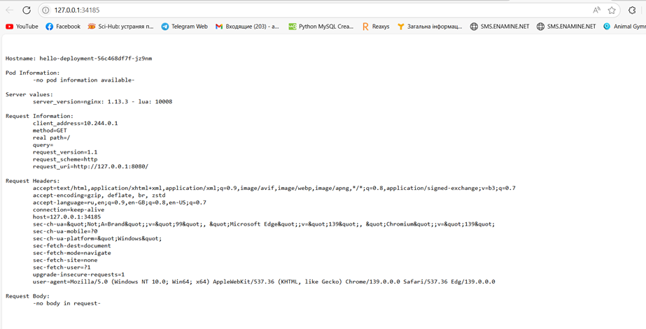
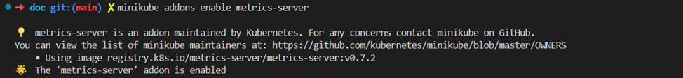
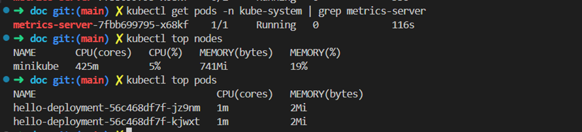
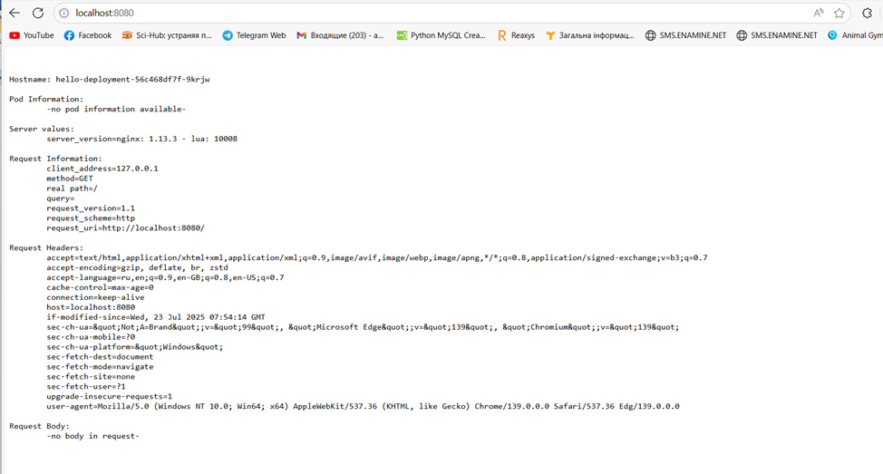
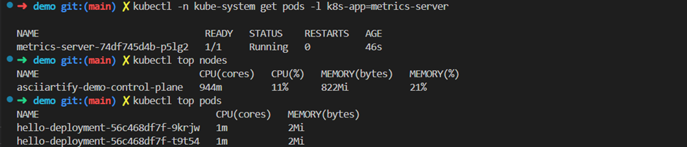
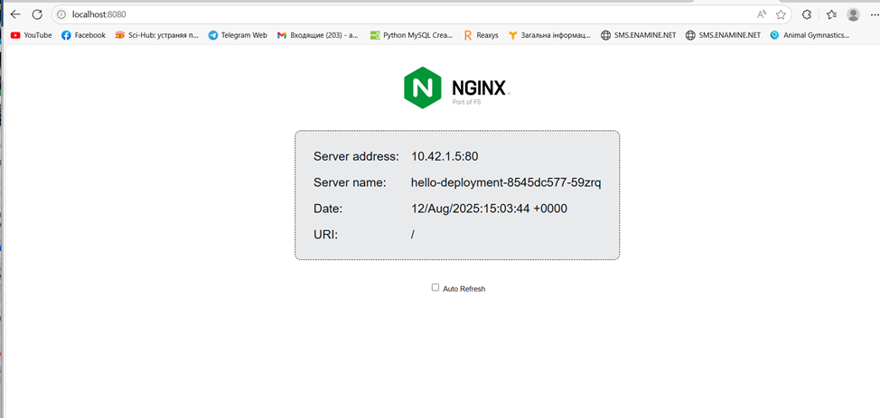
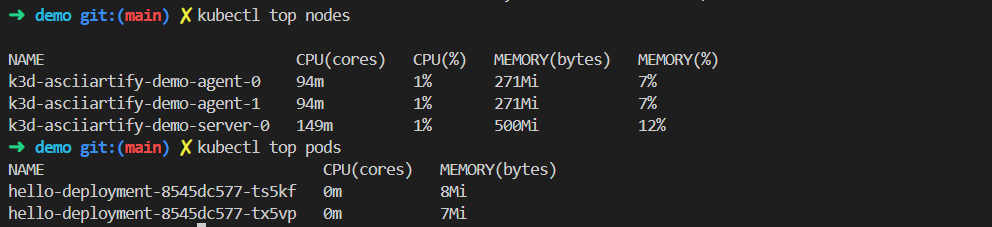

# Concept: Local Kubernetes Tools Comparison for AsciiArtify

## Introduction
This document compares three local Kubernetes solutions — **Minikube**, **Kind**, and **K3d** — to determine the most suitable tool for the Proof of Concept (PoC) phase of the AsciiArtify project.  
The comparison is based on features, startup speed, ease of use, scalability, community support, and demonstration results.

---

## Comparison Table

| Feature / Tool        | Minikube                                           | Kind (Kubernetes in Docker)                   | K3d (Rancher in Docker)                      |
|-----------------------|----------------------------------------------------|-----------------------------------------------|----------------------------------------------|
| OS Support            | Linux, macOS, Windows                              | Linux, macOS, Windows                         | Linux, macOS, Windows                        |
| Architecture          | amd64, arm64                                       | amd64, arm64                                  | amd64, arm64                                 |
| Automation            | CLI, API, addons                                   | CLI, API                                      | CLI                                          |
| Monitoring Addons     | Built-in (metrics-server, dashboard, etc.)         | Requires manual setup                         | Requires manual setup                        |
| Startup Speed         | ~5 min                                             | ~1 min                                        | ~10–20 sec                                   |
| Scalability           | Limited by local resources                         | Flexible, multi-node supported                | Flexible, multi-node supported               |
| Documentation         | Extensive                                          | Good                                          | Good                                         |
| Community Support     | Large                                              | Medium                                        | Medium                                       |
| Docker Dependency     | Yes (can also use Podman)                          | Yes                                           | Yes                                          |
| Best For              | Beginners, testing monitoring, demos               | CI/CD pipelines, lightweight local testing    | Fast prototyping, multi-cluster development  |

### Minikube
**Pros:** Beginner-friendly, ready-to-use add-ons, Podman driver available  
**Cons:** Slower with VM drivers, less popular for CI  

### Kind
**Pros:** Fast multi-node clusters, standard in CI/CD pipelines  
**Cons:** Limited GUI, accessing services from host harder  

### k3d
**Pros:** Very fast, low resource usage, built-in loadbalancer  
**Cons:** Uses k3s (not fully upstream kubeadm), Podman support experimental  


---

## Docker Licensing & Podman
- Docker Desktop has licensing limitations for enterprises. For small teams or PoC, usually fine.  
- Podman is a free alternative, rootless, partially compatible with minikube/kind/k3d.  
---

## Conclusion

For the AsciiArtify startup’s local Kubernetes PoC, Minikube is recommended. It provides a stable and fully-featured single-node or multi-node cluster, is easy to install and use, and has strong community support. While other tools like kind and k3d offer faster startup times, Minikube ensures maximum compatibility, better monitoring support (metrics-server), and the possibility to switch drivers to Podman if Docker licensing is a concern. Overall, Minikube balances simplicity, stability, and flexibility, making it the ideal choice for local development and experimentation.

For my task, it is most convenient to use **Minikube**,  
because:
- Metrics work “out of the box”
- Easy access to services
- Minimal additional configuration
- Well suited for local development


### 1. Minikube

- **Kind Demo:** [View Recording](https://asciinema.org/a/zWSF7XjIvbgwvEVSP8HF83XKU)

#### Commands

```bash
# Start a Minikube cluster with 2 nodes
minikube start --driver=docker --nodes=2 --memory=2200 --cpus=2

# Deploy the Hello World application
kubectl apply -f doc/demo/hello-deployment.yaml

# Get the service URL to access the app
minikube service hello-service --url
http://127.0.0.1:34185



# Enable metrics-server addon for monitoring
minikube addons enable metrics-server

# Wait ~30 seconds for the addon to be ready
kubectl top nodes
kubectl top pods
```


#### Deployment YAML (hello-deployment.yaml)
```bash
apiVersion: apps/v1
kind: Deployment
metadata:
  name: hello-deployment
spec:
  replicas: 2
  selector:
    matchLabels:
      app: hello
  template:
    metadata:
      labels:
        app: hello
    spec:
      containers:
      - name: hello-container
        image: k8s.gcr.io/echoserver:1.10
        ports:
        - containerPort: 8080
---
apiVersion: v1
kind: Service
metadata:
  name: hello-service
spec:
  selector:
    app: hello
  ports:
    - protocol: TCP
      port: 80
      targetPort: 8080
  type: NodePort
```

### 2. Kind

- **Kind Demo:** [View Recording](https://asciinema.org/a/zWSF7XjIvbgwvEVSP8HF83XKU)

#### Commands

```bash
# Create a Kind cluster
kind create cluster --name asciiartify-demo

# Deploy the Hello World application
kubectl apply -f doc/demo/hello-deployment.yaml

# Port-forward service to access the app
kubectl port-forward service/hello-service 8080:80
http://localhost:8080/


# Enable metrics-server (using deployment from GitHub)
kubectl apply -f https://github.com/kubernetes-sigs/metrics-server/releases/latest/download/components.yaml

# Wait ~30 seconds, then check node metrics
kubectl top nodes

# Check pod metrics
kubectl top pods
```


#### Deployment YAML (hello-deployment.yaml)
```bash
apiVersion: apps/v1
kind: Deployment
metadata:
  name: hello-deployment
spec:
  replicas: 2
  selector:
    matchLabels:
      app: hello
  template:
    metadata:
      labels:
        app: hello
    spec:
      containers:
      - name: hello-container
        image: k8s.gcr.io/echoserver:1.10
        ports:
        - containerPort: 8080
---
apiVersion: v1
kind: Service
metadata:
  name: hello-service
spec:
  selector:
    app: hello
  ports:
    - protocol: TCP
      port: 80
      targetPort: 8080
  type: NodePort
```

### 2. K3d

- **K3d Demo:** [View Recording](https://asciinema.org/a/f3AJDX7NyaMcOg9bxIwRmiOGX)

#### Commands

```bash
# Create a K3d cluster with 1 server and 2 agents, expose port 8080
k3d cluster create asciiartify-demo --servers 1 --agents 2 --port "8080:80@loadbalancer"

# Deploy the Hello World application
kubectl apply -f doc/demo/k3d.yaml



# Wait ~30 seconds, then check node metrics
kubectl top nodes
# Check pod metrics
kubectl top pods
```


#### Deployment YAML (k3d.yaml)

```bash
apiVersion: apps/v1
kind: Deployment
metadata:
  name: hello-deployment
spec:
  replicas: 2
  selector:
    matchLabels:
      app: hello
  template:
    metadata:
      labels:
        app: hello
    spec:
      containers:
        - name: hello
          image: nginxdemos/hello
          ports:
            - containerPort: 80
---
apiVersion: v1
kind: Service
metadata:
  name: hello-service
spec:
  type: LoadBalancer
  selector:
    app: hello
  ports:
    - port: 80
      targetPort: 80
```