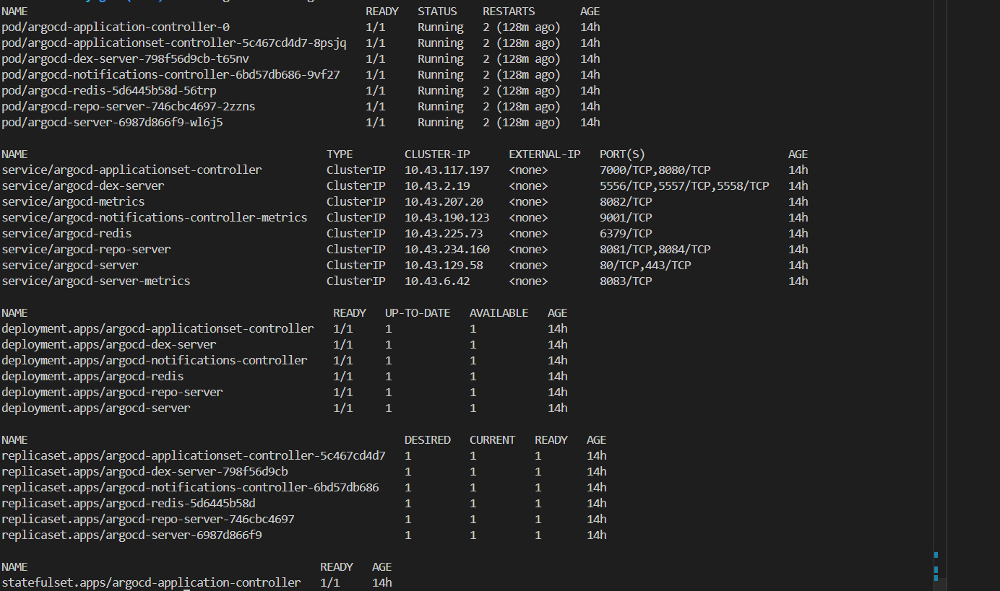
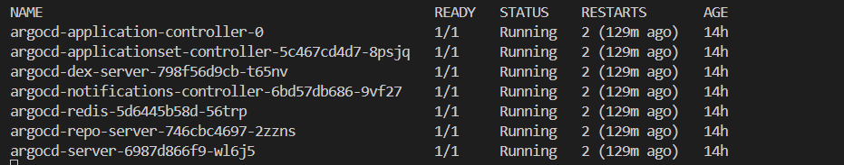
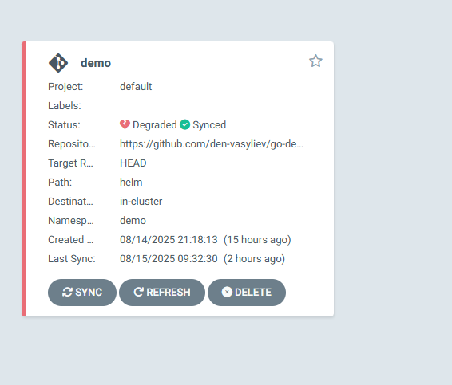
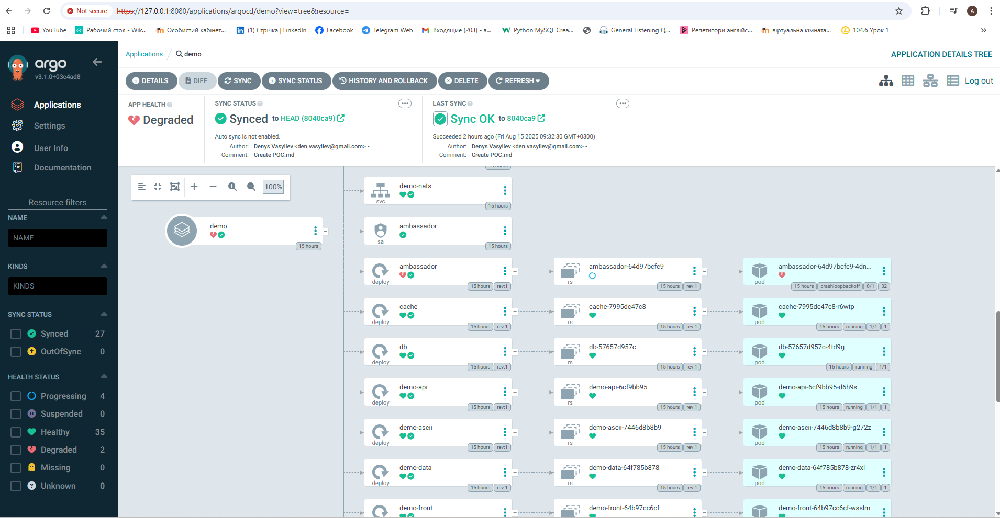

# Proof of Concept: Deploying ArgoCD on Kubernetes

This document describes the steps performed to deploy **ArgoCD** on a Kubernetes cluster and configure access to its web interface.

## Prerequisites
- A running Kubernetes cluster
- `kubectl` installed and configured
- Internet access for downloading manifests

---

## Deployment Steps

```bash
# 1. Create a dedicated namespace for ArgoCD
   kubectl create namespace argocd

# 2. Install ArgoCD in the argocd namespace
    kubectl apply -n argocd -f https://raw.githubusercontent.com/argoproj/argo-cd/stable/manifests/install.yaml

# 3. Check if ArgoCD resources are created
    kubectl get all -n argocd
```

```bash
# 4. Watch ArgoCD pods until they are ready
    kubectl get po -n argocd -w
```


```bash
# 5. Port-forward the ArgoCD API server to access it locally
    kubectl port-forward svc/argocd-server -n argocd 8080:443

I can now access the ArgoCD web interface at: https://127.0.0.1:8080

# 6. Retrieve the initial admin password
    kubectl -n argocd get secret argocd-initial-admin-secret -o jsonpath="{.data.password}" | base64 -d; echo
```

## Accessing ArgoCD UI

Open your browser and go to:
https://localhost:8080

Login with:
    Username: admin
    Password: *******************

Let's create an Argo CD application using the graphical
interface.
Enter the URL of the repository that contains the manifests for
deployment. I used the URL that was given in the practice:
https://github.com/den-vasyliev/go-demo-app.





## Demo

https://www.loom.com/share/21814913f1ed42c1879ee94e011e8825?sid=d4541d36-ab83-4dc7-89a9-df2316e2324b
